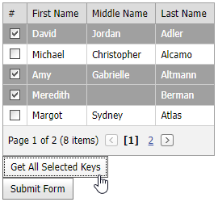

# GridView for ASP.NET MVC - How to Get All GridView Selected Keys and Pass Them to a Controller

<!-- run online -->
**[[Run Online]](https://codecentral.devexpress.com/e20065/)**
<!-- run online end -->

This examle demonstrates how to get all GridView selected keys and pass them to a controller.



Set up the GridView, specify its [CallbackRouteValues](https://docs.devexpress.com/AspNetMvc/DevExpress.Web.Mvc.AutoCompleteBoxBaseSettings.CallbackRouteValues) property, and handle the [SelectionChanged](https://docs.devexpress.com/AspNet/js-ASPxClientGridView.SelectionChanged) event. In the event handler, call the [GetSelectedFieldValues](https://docs.devexpress.com/AspNet/js-ASPxClientGridView.GetSelectedFieldValues(fieldNames-onCallback)) method to obtain the specified field values.

```xml
// Index.cshtml
@Html.Partial("GridViewEditingPartial", Model)

// GridViewEditingPartial.cshtml
@Html.DevExpress().GridView(settings => {
    settings.Name = "grid";
    settings.KeyFieldName = "PersonID";
    settings.CallbackRouteValues = new { Controller = "Home", Action = "GridViewEditingPartial" };

    settings.CommandColumn.Visible = true;
    settings.CommandColumn.ShowSelectCheckbox = true;
    settings.ClientSideEvents.SelectionChanged = "OnSelectionChanged";
    ...
}).Bind(Model).GetHtml()
```

```xml
var selectedIDs;
function OnSelectionChanged(s, e) {
    s.GetSelectedFieldValues("PersonID", GetSelectedFieldValuesCallback);
}
function GetSelectedFieldValuesCallback(values) {
    // Obtain all selected keys
    selectedIDs = values.join(',');
}
```

Use one of the following approaches to pass the values to the controller:

* Handle the grid's client-side [MVCxClientGridView.BeginCallback](https://docs.devexpress.com/AspNetMvc/js-MVCxClientGridView.BeginCallback) event. In the handler, assign selected values to the [MVCxClientBeginCallbackEventArgs.customArgs](https://docs.devexpress.com/AspNetMvc/js-MVCxClientBeginCallbackEventArgs.customArgs) argument property to pass them to the server as a request parameter. Handle the grid's [CallbackRouteValues.Action](https://docs.devexpress.com/AspNetMvc/DevExpress.Web.Mvc.AutoCompleteBoxBaseSettings.CallbackRouteValues) method to get all selected field values from the `e.customArgs` property.

  ```xml
  // GridViewEditingPartial.cshtml
  @Html.DevExpress().GridView(settings => {
    ...
    settings.ClientSideEvents.BeginCallback = "OnBeginCallback";
    ...
  
  // Index.cshtml
  function OnBeginCallback(s, e) {
      e.customArgs["selectedIDs"] = selectedIDs;
  }
  ```

  ```c#
  // HomeController.cs
  public ActionResult GridViewEditingPartial() {
      string _selectedIDs = Request.Params["selectedIDs"];
      ViewData["_selectedIDs"] = _selectedIDs;
      
      return PartialView(list.GetPersons());
  }
  ```

* On a button's `Click` event, write all selected values to a hidden input element. Get these values on any controller post action.

  ```xml
  // Index.cshtml
  @using(Html.BeginForm("Index", "Home")) {
      @Html.Hidden("selectedIDsHF");
      @Html.DevExpress().Button(settings => {
          settings.Name = "btnSubmit";
          settings.Text = "Submit Form";
          settings.UseSubmitBehavior = true;
          settings.ClientSideEvents.Click = "OnSubmitClick";
      }).GetHtml()
  }
  ```

  ```c#
  // HomeController.cs
  public ActionResult Index(string selectedIDsHF) {
      string _selectedIDs = selectedIDsHF;

      return View(list.GetPersons());
  }
  ```

## Documentation

- [Passing Values to a Controller Action through Callbacks](https://docs.devexpress.com/AspNetMvc/9941/common-features/callback-based-functionality/passing-values-to-a-controller-action-through-callbacks)
- [CallbackRouteValues](https://docs.devexpress.com/AspNetMvc/DevExpress.Web.Mvc.AutoCompleteBoxBaseSettings.CallbackRouteValues)
- [SelectionChanged](https://docs.devexpress.com/AspNet/js-ASPxClientGridView.SelectionChanged)
- [GetSelectedFieldValues](https://docs.devexpress.com/AspNet/js-ASPxClientGridView.GetSelectedFieldValues(fieldNames-onCallback))
- [BeginCallback](https://docs.devexpress.com/AspNetMvc/js-MVCxClientComboBox.BeginCallback)

## Files to Look At

* [HomeController.cs](./CS/Sample/Controllers/HomeController.cs) (VB: [HomeController.vb](./VB/Sample/Controllers/HomeController.vb))
* [GridViewEditingPartial.cshtml](./CS/Sample/Views/Home/GridViewEditingPartial.cshtml)
* [Index.cshtml](./CS/Sample/Views/Home/Index.cshtml)
